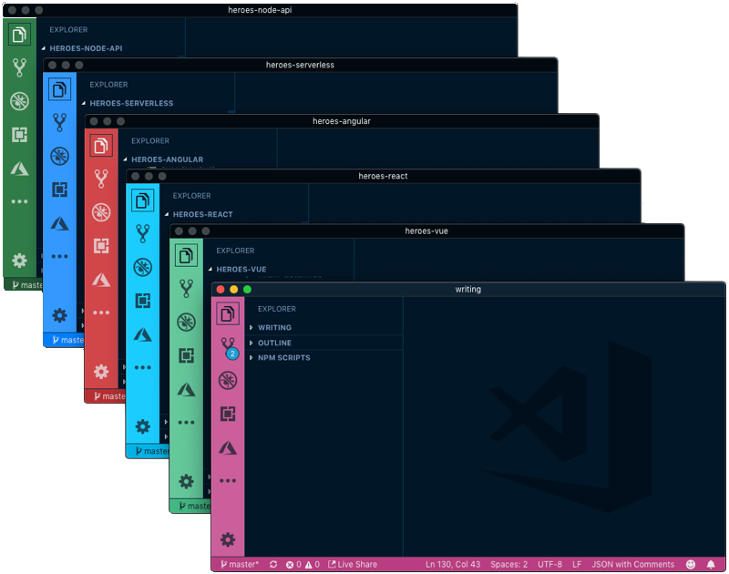
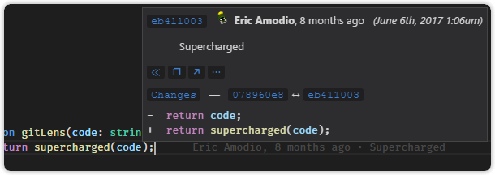
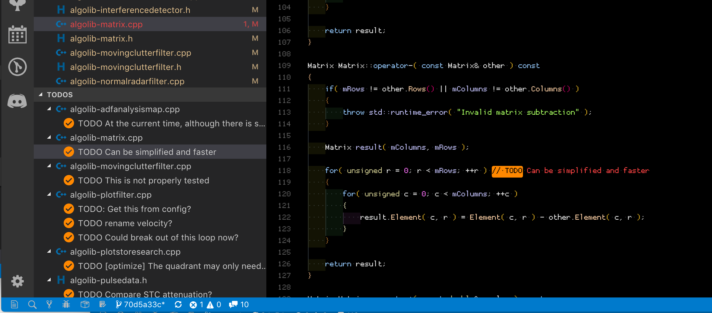

Yes, this is yet another blog post about some random internet users'
favourite VS Code extensions.

<!-- end -->

**TL;DR:**

  * [Peacock](#peacock)
  * [Git Lens](#git-lens)
  * [TODO Tree](#todo-tree)
  * [ESLint](#eslint)
  * [EditorConfig](#editorconfig)
  * [Markdown All In One](#markdown-all-in-one)
  * [Markdown PDF](#markdown-pdf)

This post will give a brief overview of each extension.

## Extensions

### Peacock

[Marketplace Link](https://marketplace.visualstudio.com/items?itemName=johnpapa.vscode-peacock)

**Q: What does it do?**
> A: Customize the colours of UI elements like the sidebar and status bar, per window/instance.

**Q: Why?**
> A: Useful for quickly differentiating between different instances/workspaces that are open.

### Git Lens

[Marketplace Link](https://marketplace.visualstudio.com/items?itemName=eamodio.gitlens)

**Q: What does it do?**
> A: Adds Git functionality like live blame (hover to view the author of a particular line),
easy navigation of file history, and visualization of changes.

**Q: Why?**
> A: Built-in Git support is lacking in features and it can be more productive to use an extension rather
than to switch applications or to rely solely on the Git CLI, especially for beginners.

### TODO Tree

[Marketplace Link](https://marketplace.visualstudio.com/items?itemName=Gruntfuggly.todo-tree)

**Q: What does it do?**
> A: Displays TODOs located within your project in a tree-view in the sidebar.

**Q: Why?**
> A: For those that use TODOs as a task management system, this extension can help keep track
of existing TODOs and ensure they are resolved.

### ESLint

[Marketplace Link](https://marketplace.visualstudio.com/items?itemName=dbaeumer.vscode-eslint)

**Q: What does it do?**
> A: Integrates [ESLint](https://eslint.org) into VS Code and providing inline hints. It will automatically
use the ESLint configuration of the project.

**Q: Why?**
> A: Linters help maintain code quality and consistency. Integration into the editor instead of running
it explicitly on the command line helps catch mistakes as they happen.

### EditorConfig

[Marketplace Link](https://marketplace.visualstudio.com/items?itemName=EditorConfig.EditorConfig)

**Q: What does it do?**
> A: Integrates the [.editorconfig](https://editorconfig.org/) format into VS Code and automatically
formats files (e.g. indent sizing and trailing newlines) on save.

**Q: Why?**
> A: Consistent coding style within a project reduces cognitive load due to stylistic differences.
`.editorconfig` helps maintain a coding style across editors and IDEs (provided they have support for it).

### Markdown All In One

[Marketplace Link](https://marketplace.visualstudio.com/items?itemName=yzhang.markdown-all-in-one)

**Q: What does it do?**
> A: Provides Markdown editing features such as HTML previewing, automatic table of contents generation,
list editing, and auto-completion.

**Q: Why?**
> A: It helps you create and maintain high-quality Markdown documentation.

### Markdown PDF

[Marketplace Link](https://marketplace.visualstudio.com/items?itemName=yzane.markdown-pdf)

**Q: What does it do?**
> A: Converts Markdown files to PDFs.

**Q: Why?**
> A: This is useful for those who prefer Markdown over Google Docs yet need to send a professional
PDF to some business-people.
